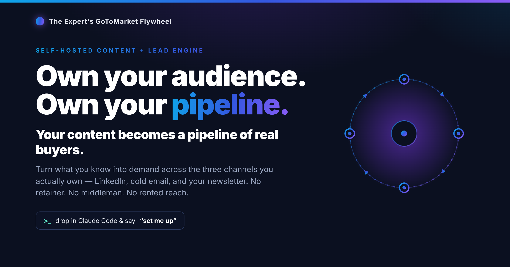
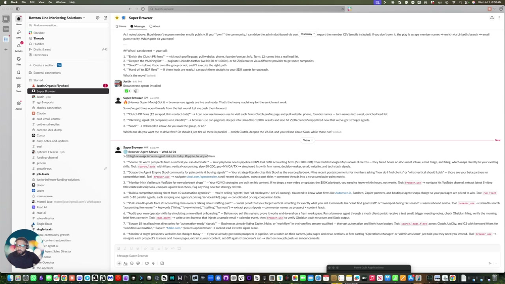
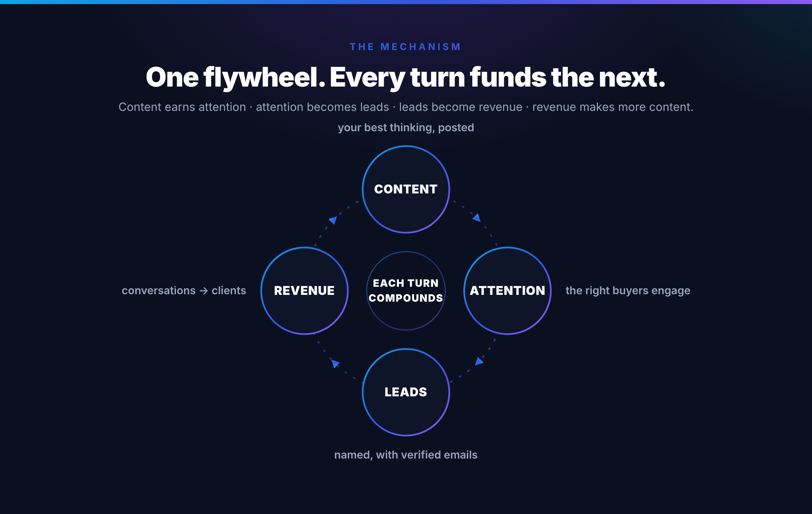
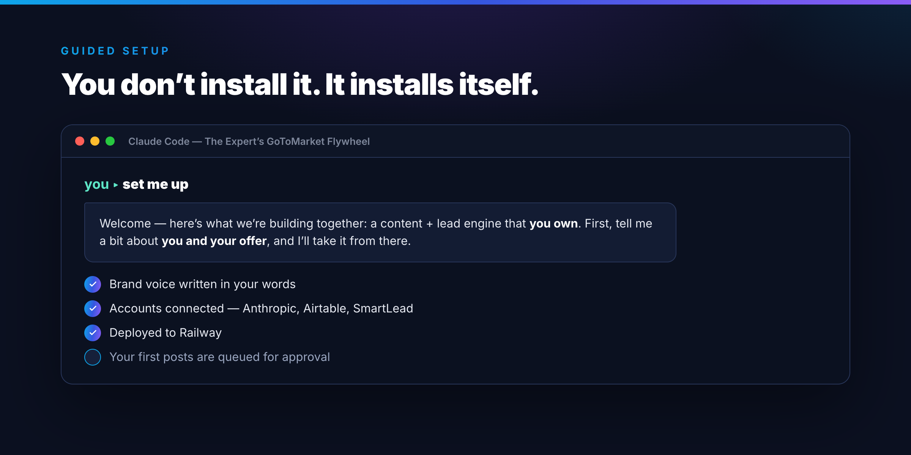
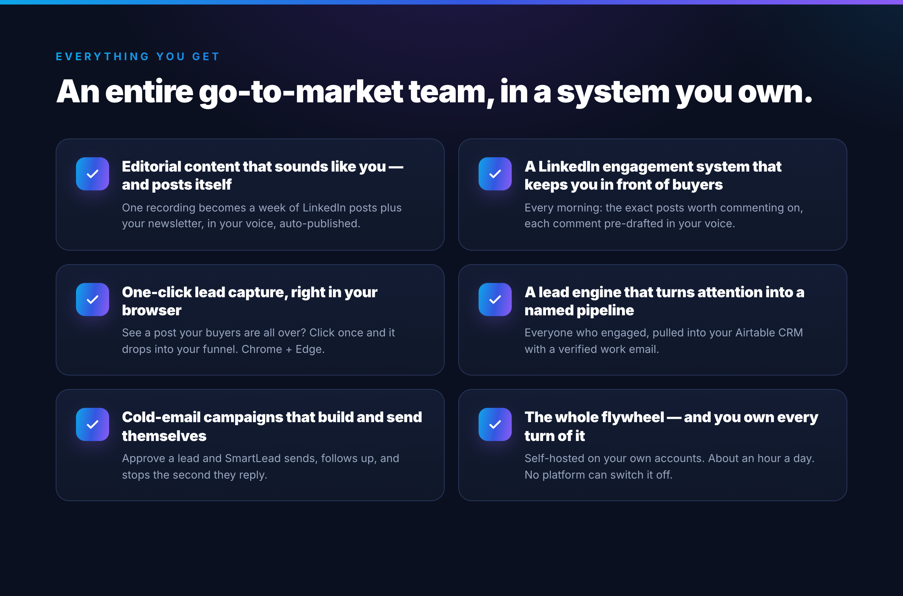
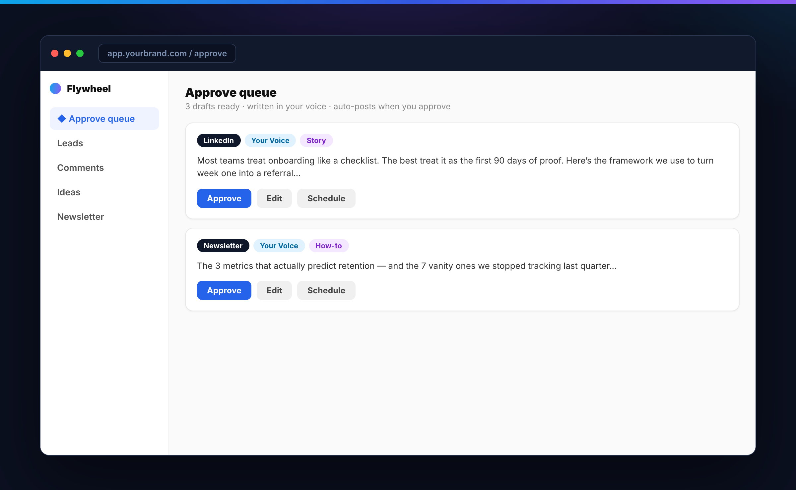
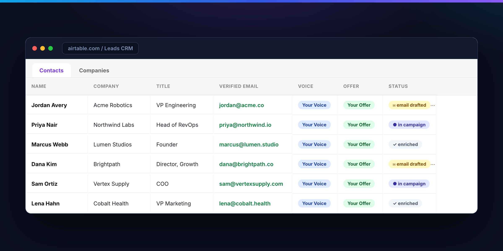
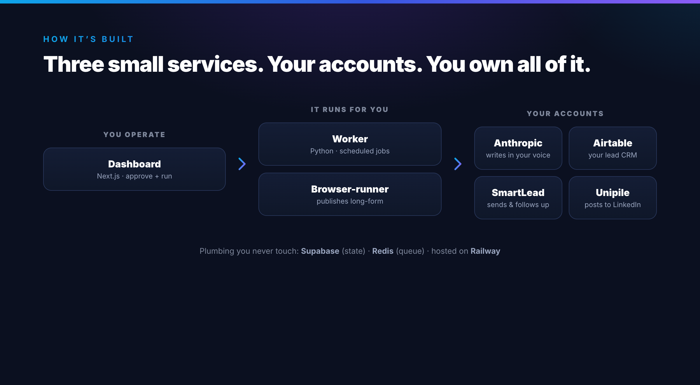

<p align="center">
  
</p>

<p align="center">
  
  
  
  
</p>

**The Expert's GoToMarket Flywheel** is a self-hosted content + lead engine — one system
that turns what you know into a pipeline, across the three channels you own:
**LinkedIn, cold email, and your newsletter.**

The platforms rent you an audience and change the rules whenever they like. Agencies
and bureaus rent you a pipeline and skim every deal. This flips it: a system **you**
run, on **your** accounts, building an audience **you** keep and a pipeline **you**
control. No retainer. No middleman. No rented reach. You own the content, the
contacts, the data, and the machine that makes them — and it runs on about **an hour
a day.**

> ## Want help installing this or taking it off your plate?
> If you're here, you're probably an expert who either wants this installed the right
> way, wants help making it work, or wants the whole RevOps / AI-ops side taken off
> your plate.
>
> I don't care if you pay me or not. If you want help, book a time and I'll help you
> get it installed:
> **[cal.com/usingaitoscale/aiintegraterz](https://cal.com/usingaitoscale/aiintegraterz)**
>
> Want the quick walkthrough first? Click the preview below:
> [](https://www.loom.com/share/6ffcfa3212b54fd88701f627cd55fe8d)
>
> **[Watch on Loom](https://www.loom.com/share/6ffcfa3212b54fd88701f627cd55fe8d)** | **[Download the MP4](docs/assets/how-we-grew-linkedin-to-10k-signals.mp4)**
>
> If you want more than installation, that's what we do. We plug an **AI Integrator**
> or **AI Operator** into your business to help run this, extend this, or build the
> other AI automations you specifically need.
>
> This is not an agency retainer game. We place a real person into your business —
> part-time or full-time — who learns your company, knows your workflows, and works
> proactively to help you. If you want us to manage that person until you're ready to
> bring it in-house, we can do that. If you want us to keep running it long-term,
> that's fine too. Either way, it's your operator, not rented agency overhead.

<p align="center">
  
</p>

---

## What makes this different: it sets *itself* up

You don't need to be technical. **Drop this repo into [Claude Code](https://claude.com/claude-code)
or Codex and say "set me up."** An onboarding assistant introduces itself, learns
about you and your offer in a short interview, writes your brand voice, walks you
through connecting your accounts, deploys the system, and hands you your daily
routine — one step at a time, doing the work with you.

```
1. Open this folder in Claude Code (or Codex)
2. Say:  set me up
3. Answer its questions + paste a few API keys when asked
```

That's the whole install. It takes ~60–90 minutes and you can stop and resume anytime.

<p align="center">
  
</p>

---

## What you get

<p align="center">
  
</p>

- **Editorial-grade content that actually sounds like you — and posts itself.**
  One recording (or a single idea) becomes a full week of LinkedIn posts — plus
  Substack, Medium, and a newsletter — each written in *your* voice, wrapped in an
  on-brand image, carousel, or short video, and auto-published at the right time. You
  approve from your phone in minutes. No ghostwriter, no agency retainer, no generic
  AI sludge — your best thinking, at volume.

- **A LinkedIn engagement system that keeps you in front of buyers.**
  Every morning you get the exact posts worth commenting on, each with a sharp comment
  already drafted in your voice. Stay top-of-feed with your market in ten minutes —
  without disappearing into the scroll.

- **One-click lead capture, right in your browser (Chrome + Edge).**
  See a post your buyers are all over? Click once and it goes straight into your
  funnel — no copy-paste, no tab-juggling. A browser extension built for **Chrome and
  Microsoft Edge** (works in any Chromium browser) ships with the system.

- **A lead engine that turns attention into a named pipeline.**
  Drop any LinkedIn post and the system pulls *everyone* who engaged into your
  **Airtable** CRM, finds each person's company and a **verified work email**, and
  writes each one a personal cold email that opens on what they actually care about.
  You go from "that post got likes" to a CRM full of real buyers with real inboxes —
  automatically.

- **Cold-email campaigns that build and send themselves — with SmartLead.**
  The system creates your **SmartLead** campaign for you: your sequence, your
  follow-ups, your schedule. Approve a lead and it drops in, sends, spaces itself out,
  follows up — and **stops the second they reply.** You wake up to conversations, not
  to a CRM you have to work by hand.

- **Optional SpeakerAgent lane for podcast outreach.**
  If you use **SpeakerAgent.ai**, the dashboard can also pull in podcast matches,
  generate host outreach drafts, and keep status in sync while you send from your own
  inbox. The public integration surface is the
  **[speakeragent-cli](https://github.com/jbellsolutions/speakeragent-cli)** plus a
  simple API connection in the dashboard.

- **The whole flywheel — and you own every turn of it.**
  Content earns attention → attention becomes leads → leads become revenue → revenue
  funds more content. It's self-hosted on your own accounts, runs on ~1 hour a day,
  and there's no platform that can switch it off.

It's modular — start with LinkedIn today and switch on the newsletter and the lead
engine whenever you're ready.

---

## See it in action

**Approve your content, then work your pipeline — all from one dashboard.**
Drafts land already written in your voice; approve from your phone and they post
themselves.

<p align="center">
  
</p>

**Every person who engages becomes a named contact — with a verified work email.**
Drop a post, and its commenters land in your Airtable CRM, enriched and ready for a
personal cold email.

<p align="center">
  
</p>

---

## What it runs on

Your own accounts (most have generous free tiers). The onboarding assistant sets up
each one and tells you exactly what it's for:

- **Anthropic** — the AI that writes in your voice
- **Airtable** — your lead CRM, where you work every contact
- **SmartLead** — the cold-email sending + follow-up engine
- **SpeakerAgent.ai** — optional podcast lead source + outreach drafting lane
- **Unipile** — publishes to your LinkedIn
- **Railway** — hosts the system
- **Firecrawl · Kit · Browser Use Cloud · enrichment providers** — switched on as you
  turn features on (engagement discovery, newsletter, Substack/Medium, lead enrichment)

Behind the scenes it keeps its own state in a small **Supabase** database + Redis —
plumbing you never touch. Nothing is hardcoded to a vendor you can't swap, and **your
keys live only in `.env.local`, which is never committed.**

---

## How it's built

Three small services — a Python **worker** that runs the scheduled jobs, a
**browser-runner** that publishes long-form, and a **Next.js dashboard** you operate
it from — on your own accounts, hosted on Railway.

<p align="center">
  
</p>

Full picture in [`docs/ARCHITECTURE.md`](docs/ARCHITECTURE.md).

## Your day, once it's running

About an hour: approve the queued posts, work the engagement list, drop a few good
posts into the lead funnel, and triage the new leads in **Airtable**. The full routine
is in [`docs/OPERATING.md`](docs/OPERATING.md).

---

## Docs

- [`docs/ONBOARDING.md`](docs/ONBOARDING.md) — the guided setup the assistant runs
- [`docs/ARCHITECTURE.md`](docs/ARCHITECTURE.md) — how the system works
- [`docs/OPERATING.md`](docs/OPERATING.md) — the daily operator routine
- [`docs/SMARTLEAD.md`](docs/SMARTLEAD.md) — SmartLead operating skills, rules, and campaign workflow
- [`docs/SPEAKERAGENT.md`](docs/SPEAKERAGENT.md) — SpeakerAgent CLI + API integration for podcast outreach
- `.env.example` — every key the system can use, and what each is for

> New here? Don't read these top-to-bottom. Just open the repo in Claude Code and say
> **"set me up."** The assistant takes it from there.
